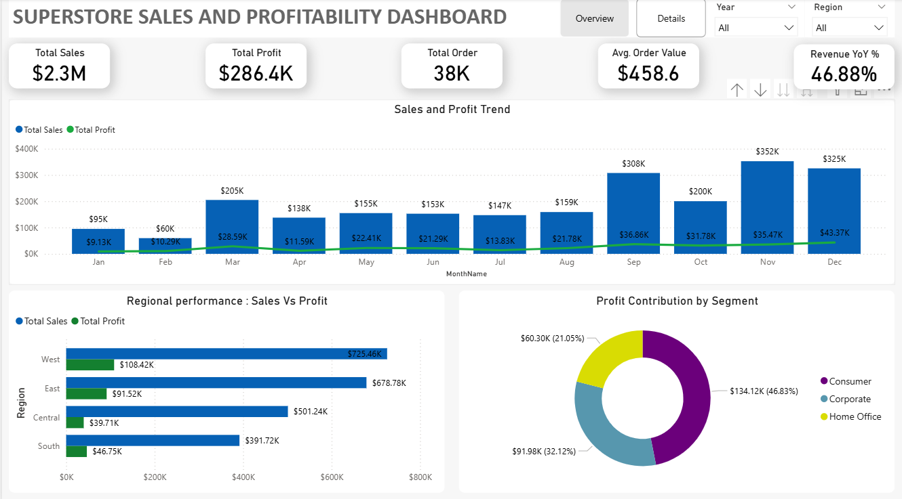
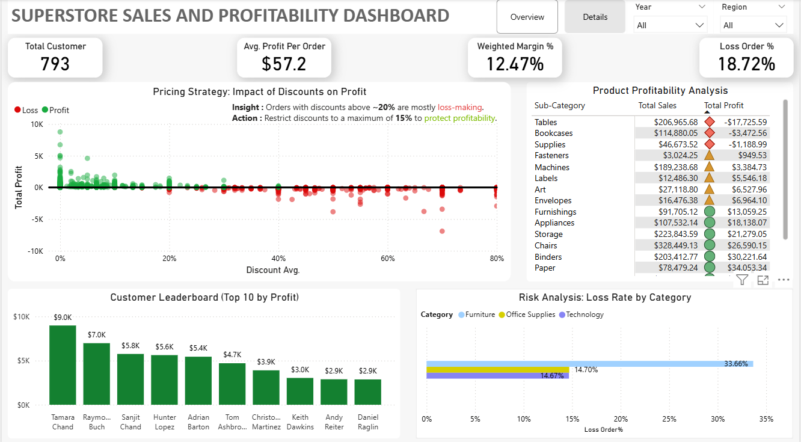
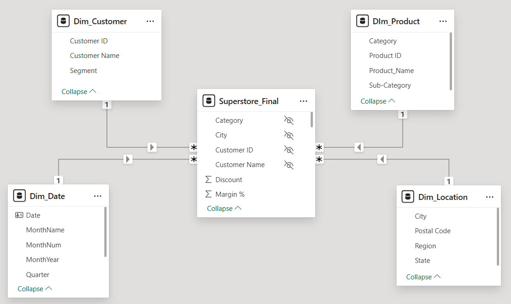

# End-to-End Superstore Sales & Profitability Analysis 📊

## 🚀 Project Overview
The Superstore is experiencing strong revenue growth but inconsistent profitability.  
This project is a **full-lifecycle BI solution** that analyzes **where profit is generated, where it is lost, and why**. It moves beyond simple reporting to provide diagnostic insights on discounting behavior, product mix, and regional performance.

The solution is designed for **business decision-makers**, providing both an executive overview and a detailed diagnostic view using a robust backend architecture.

---

## 🛠 Tech Stack & Architecture

**Database & ETL**
- **MySQL:** Used for data ingestion, cleaning, and type enforcement (ETL).
- **SQL (DDL/DML):** Feature engineering and creating the relational structure.

**Data Modeling**
- **Star Schema:** Optimized Fact/Dimension model to ensure high performance in Power BI.
- **Data Quality (DQ):** Handling nulls, distinct counts, and standardizing date formats.

**Visualization**
- **Power BI:** Dashboard development and interactive reporting.
- **DAX:** Complex measures (CALCULATE, Time Intelligence) for KPI logic.

**Architecture**
- Decoupled Pipeline: **Raw Data → SQL Staging → Cleaned Production Tables → Power BI**

---

## ⚙️ The Data Pipeline (End-to-End Workflow)

This project simulates a real-world Business Intelligence workflow, ensuring data integrity before visualization.

### 1️⃣ Data Staging & Quality Checks (MySQL)
- Imported raw sales data into a staging table (`raw_superstore_data`).
- **Data Quality Audit:** Identified and fixed inconsistencies (e.g., text-based dates, numeric values stored as strings).
- **Type Enforcement:** Designed a strict schema to prevent bad data from entering the reporting layer.

### 2️⃣ Feature Engineering & Transformation
ETL logic applied to create analytics-ready data:
- **Profit Status Logic:** Categorized orders as 'Profit', 'Loss', or 'Neutral' at the database level.
- **Metric Calculation:** Calculated `Unit Price` and `Margin %` row-by-row to avoid aggregation errors.
- **Date Standardization:** Unified formats into SQL `DATE` type for accurate Time Intelligence analysis.

### 3️⃣ Visualization Layer (Power BI)
- Connected Power BI to the **Star Schema** (Fact + Dimensions) rather than a flat file.
- **Performance Optimization:** Minimized calculated columns by moving logic to SQL/Power Query.
- **KPIs Created:**
  - Revenue YoY %
  - Weighted Margin %
  - Loss Order %
  - Average Profit per Order

---

## 📊 Dashboard Structure

### Page 1: Executive Overview
**Purpose:** High-level performance monitoring for leadership.

**Key Visuals**
- **KPI Cards:** Total Sales, Profit, Orders, AOV, and YoY Growth.
- **Trend Analysis:** Sales vs. Profit over time.
- **Regional Performance:** Map and bar charts identifying high-value regions.
- **Segment Analysis:** Profit contribution by Consumer, Corporate, and Home Office.

**Key Business Questions**
- Are we growing year-over-year?
- Is revenue growth translating into actual profit?
- Which regions are underperforming?

---

### Page 2: Profitability Diagnostics
**Purpose:** Root cause analysis for operational teams.

**Key Visuals**
- **Discount vs. Profit Scatter Plot:** Identifies the "break-even" discount threshold.
- **Product Matrix:** Sub-category analysis (Table vs. Matrix) to spot loss-makers.
- **Loss Analysis:** Percentage of loss-making orders by category.
- **Customer Insights:** Top 10 Customers by Profit vs. Revenue.

**Key Business Questions**
- At what discount level do we start losing money?
- Which specific products (e.g., Tables) are destroying margins?
- How much operational risk exists in our current discounting strategy?

---

## 🔍 Key Insights & Outcomes
- **The 20% Rule:** Discounts above ~20% consistently result in negative margins across all categories.
- **Product Mix Issues:** 'Tables' and 'Bookcases' are primary loss drivers, often sold at deep discounts.
- **Operational Risk:** Approximately **19% of all orders** are loss-making, indicating a need for stricter pricing controls.

---

## 💡 Business Recommendations
1. **Pricing Governance:** Introduce approval workflows for discounts above 15–20%.
2. **Catalog Optimization:** Reprice or bundle loss-making sub-categories (Tables).
3. **Risk Monitoring:** Track "Loss Order %" as a primary risk KPI in monthly reviews.
4. **Targeting:** Focus retention efforts on the high-margin "Corporate" segment.

---

## 📸 Dashboard Screenshots
### Executive Overview

### Profitability Details

---

## 📐 Data Model (Star Schema)
To optimize performance and simplify DAX calculations, I designed a **Star Schema** rather than using a flat table.

**Schema Details:**
- **Fact Table:** `Fact_Sales` (Contains quantitative data: Sales, Profit, Quantity)
- **Dimension Tables:** `Dim_Customer`, `Dim_Product`, `Dim_Location`, `Dim_Date`
- **Relationships:** 1-to-Many (1:*) relationships connected via surrogate keys.

---
👤 Author
Swetank Kumar Jha (https://www.linkedin.com/in/swetank-jha)
